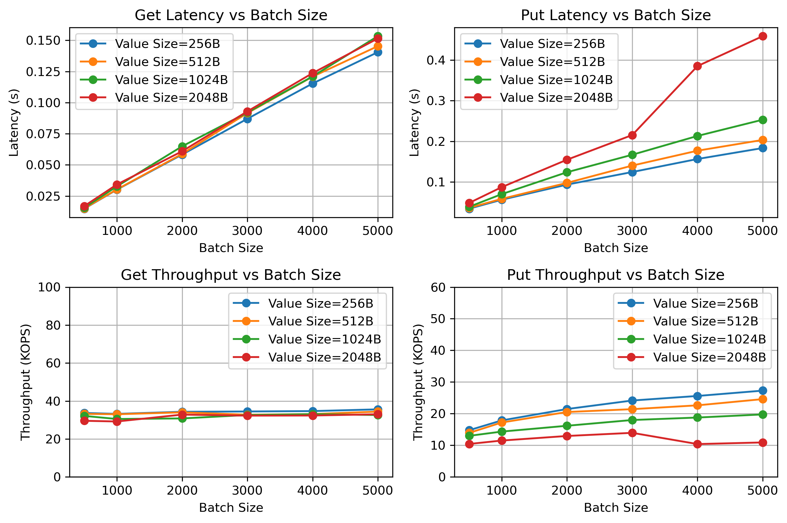
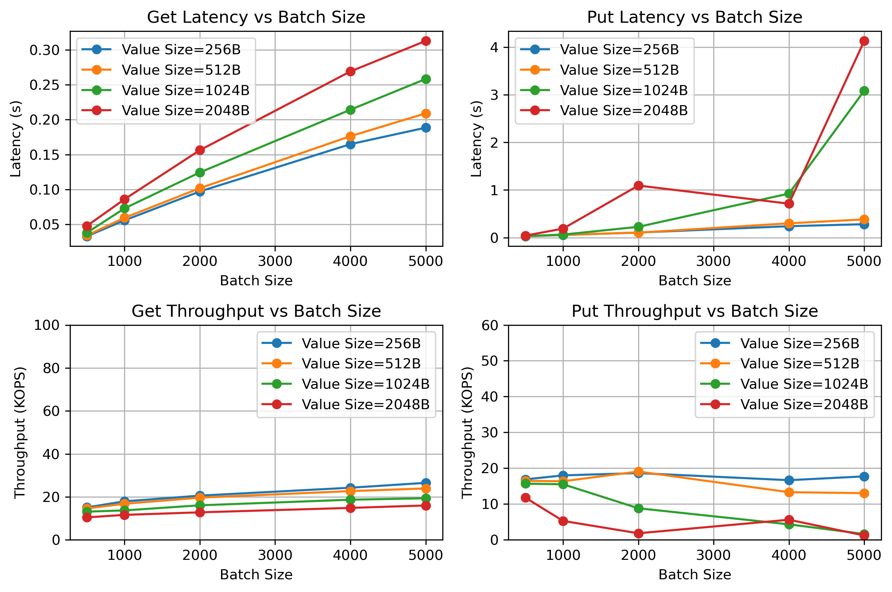

# LETUS_prototype
 


This is a prototype implementation of [LETUS: A Log-Structured Efficient Trusted Universal BlockChain Storage](https://doi.org/10.1145/3626246.3653390).

LETUS is a <u>**L**</u>og-structured <u>**E**</u>fficient <u>**T**</u>rusted <u>**U**</u>niversal <u>**S**</u>torage for blockchain, providing cryptographic tamper evidence with excellent performance and resource efficiency.
LETUS is made up of three main components: DMM-Trie, LSVPS, VDLS.
- **DMM-Trie** is a central component within the storage layer, functioning as a multi-versioned Merkle tree that provides cryptographic verification with dynamic updates and deterministic hashes.
- **LSVPS** is a log-structured, versioned, page abstraction storage subsystem used to store a large volume of pages generated by DMM-Trie.
- **VDLS** is an append-only logging stream that stores all versioned user data records.

The following figure shows the architecture of LETUS.


# Get Started
## Clone
To use LETUS_protype, developers first need to clone the main branch as their project directory.
```
$ git clone https://github.com/hongliangjie/LETUS_prototype.git
$ cd LETUS_prototype
```
The project directory should look like this:
```
.
├── LICENSE
├── build.sh                // bash script to build the project
├── run.sh                  // bash script to run a simple test
├── CMakeLists.txt          // CMake file to build the project
├── exps                    // experiment directory
│   ├── get_put.sh          // bash script to run experiment
│   ├── get_put_2.sh
│   ├── build.sh
│   └── plot.py             // python script to plot the experiment results
├── lib
|   ├── LSVPS.hpp           // LSVPS header file
│   ├── DMMTrie.hpp         // DMMTrie header file
│   ├── VDLS.hpp            // VDLS header and impelemtation
│   ├── common.hpp          // some commonly used data structures
│   └── Letus.h             // LETUS interface for C
├── src
|   ├── LSVPS.cpp           // LSVPS implementation
│   ├── DMMTrie.cpp         // DMMTrie implementation
│   └── Letus.cpp           // LETUS interface implementation
├── workload
|   ├── exes
|   |   ├── get_put.cc      // test LETUS with 
│   |   └── get_put_2.cc    // test LETUS with
│   └── lib/                // utility functions for workload generator
├── gowrapper               // go wrapper for LETUS
│   ├── go-build.sh         // bash script to build the go-wrapper
│   ├── go-run.sh           // bash script to build the go-wrapper and test it with a simple test
│   ├── letus/              // implementation of the go-wrapper
│   ├── db-interface.md     // go database interface description
│   ├── test_letus_lib.c    // a simple test for the C interface
│   └── main.go             // a simple test for the go-wrapper
└── README.md               // this file
```

## Dependencies
Developers are required to install the following dependencies:
* [CMake](https://cmake.org/) >= 3.12 or 
* C++ compiler with C++17 support (e.g., g++ >= 11.1 or clang++ >= 8.0)
* [Go](https://golang.org/) >= 1.17
* [OpenSSL](https://www.openssl.org/) >= 1.1.0

## Build
### build for release
```
$ ./build.sh
```
### build for debug
```
$ ./build.sh debug
```

### Build with go-wrapper
To integrate LETUS into hyperchain, we implement a go-wrapper for LETUS.
The go-wrapper is tested in `gowrapper/main.go`.
To build the go-wrapper, developers just run the following command.
```
$ cd gowrapper
$ ./go-build.sh
```
To test the go-wrapper, developers can run the following command.
```
$ cd gowrapper
$ ./go-run.sh
```

## Run
This command will test LETUS with the put-then-historical-get workload (described below).
```
$ ./run.sh -b [batch_size] -v [value_len] -k [key_len] -n [num_version] 2>run.log
```
> Note: in current state, the execution result is still `[ERROR] Program crashed`.

# Experiments
We test LETUS with two workloads: put-then-get and put-then-historical-get.

## put-then-get workload
The put-then-get workload is characterized by four parameters.
- `key_len`: the length of a key.
- `value_len`: the length of a value.
- `batch_size`: number of keys to insert in one batch/transaction.
- `num_version`: total number of versions, i.e. the number of batches to insert.

The workload iterate `num_version` times, and in each iteration, it test LETUS with `batch_size` of put operations and `batch_size` of get operations.

In an iteration, the workload first generates a batch of `PUT(key, value)` tasks. Each task insert a key-value record into LETUS. The generation of a key-value record is described as follow.
- key: we randomly sample a key from a zipfian distribution. To make each key has a same length (`key_len`), we set the upperbound of the sampling to 10^`key_len`.
- value: we randomly pick an ASCII charater, and repeat it `value_len` times.

Then, the workload generates a batch of `GET(key)` tasks. Each `GET` task is correspond to one `PUT` task in the batch of `PUT` tasks, and a pair of corresponding tasks have a same key.

As a result, each `GET` task can retrieve the value inserted by the `PUT` task.

## put-then-historical-get workload
The put-then-historical-get workload is also characterized by four parameters: `key_len`, `value_len`, `batch_size`, `num_version`.

At first, the workload iterate `num_version` times. In the `i`-th iteration, the workload generates a batch of `PUT(key, value, version)` tasks, where the `version` is set to `i`.

Then, again, the workload iterate `num_version` times, and this time it generates a batch of `GET(key, version)` tasks in the `i`-th iteration, where the `version` is set to `i`.

As a result, each `GET` task can retrieve the value inserted by the `PUT` task with a specific version.

## Run experiments
This command will run put-then-historical-get workload multiple times to scan `batch_size` in `[500,1000,2000,3000,4000,5000]`, `value_len` in `[256, 512, 1024, 2048]` bytes. The `key_len` is set to 5 bytes and `num_version` is set to 1000.
```
$ cd exps/
$ ./test_get_put.sh 2> get_put_2.log
```
The execution will produce a plot of latency and throughput in `exps/results`.


This command will run put-then-historical-get workload multiple times to scan `batch_size` in `[10,20,30,40,50,60]`, `value_len` in `[256, 512, 1024, 2048]` bytes. The `key_len` is set to 5 bytes and `num_version` is set to 1000.
The execution will produce a plot of latency and throughput in `exps/results`.
```
$ cd exps/
$ ./test_get_put_2.sh 2> get_put_2.log
```


# Citation
