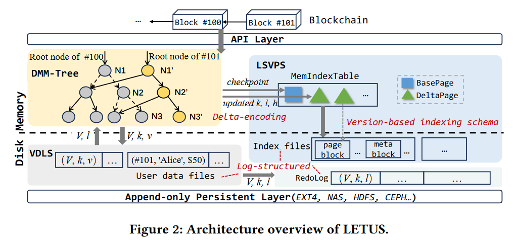

# LETUS_prototype Go-wrapper
 


This is a prototype implementation of [LETUS: A Log-Structured Efficient Trusted Universal BlockChain Storage](https://doi.org/10.1145/3626246.3653390).

LETUS is a <u>**L**</u>og-structured <u>**E**</u>fficient <u>**T**</u>rusted <u>**U**</u>niversal <u>**S**</u>torage for blockchain, providing cryptographic tamper evidence with excellent performance and resource efficiency.
LETUS is made up of three main components: DMM-Trie, LSVPS, VDLS.
- **DMM-Trie** is a central component within the storage layer, functioning as a multi-versioned Merkle tree that provides cryptographic verification with dynamic updates and deterministic hashes.
- **LSVPS** is a log-structured, versioned, page abstraction storage subsystem used to store a large volume of pages generated by DMM-Trie.
- **VDLS** is an append-only logging stream that stores all versioned user data records.

The following figure shows the architecture of LETUS.



# Get Started
## Clone
To use LETUS_protype, developers first need to clone the main branch as their project directory.
```
$ git clone https://github.com/hongliangjie/LETUS_prototype.git
$ cd LETUS_prototype
$ git checkout go-release
$ cd gowrapper/
```
The project directory should look like this:
```
.
├── LICENSE
├── gowrapper               // go wrapper for LETUS
│   ├── data/               // data path, create by the developer
│   ├── letus/              // implementation of the go-wrapper
│   ├── go-build.sh         // bash script to build the go-wrapper
│   ├── go-run.sh           // bash script to build the go-wrapper and test it with a simple test
│   ├── main.go             // a simple test for the go-wrapper
|   ├── ctest_build.sh      // bash script to build the C test (test_letus_lib.c)
│   ├── test_letus_lib.c    // a simple test for the C interface
│   └── db-interface.md     // go database interface description
└── README.md               // this file

```

## Dependencies
Developers are required to install the following dependencies:
* [Go](https://golang.org/) >= 1.17
* [OpenSSL](https://www.openssl.org/) >= 1.1.0

## Build
To integrate LETUS into hyperchain, we implement a go-wrapper for LETUS.
The go-wrapper is tested in `gowrapper/main.go`.
To build the go-wrapper, developers just run the following command.
```
$ cd gowrapper
$ ./go-build.sh
```
To test the go-wrapper, developers can run the following command.
```
$ cd gowrapper
$ ./go-run.sh
```


# Citation
